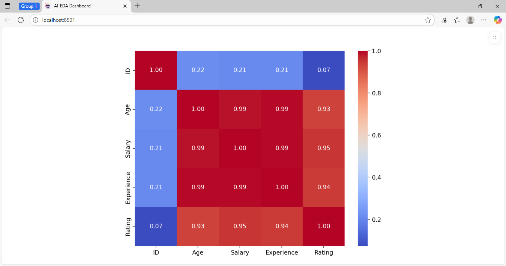
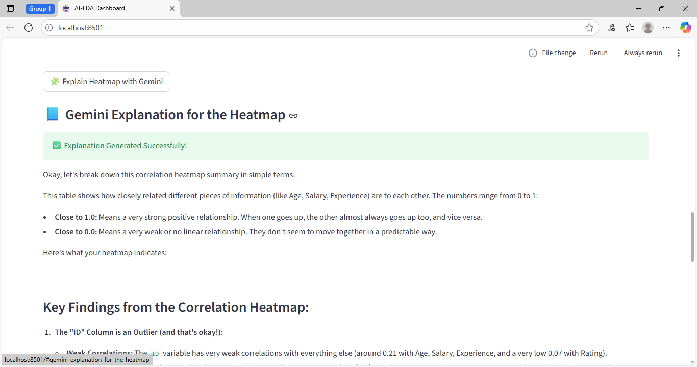

#AI-Assisted Exploratory Data **Analysis Dashboard**  
 [](https://www.python.org/)  
 [](https://streamlit.io/)  
 [](https://ai.google.dev/gemini-api)  
 [](LICENSE)  
##Project Overview  
An interactive **AI-powered dashboard** for Exploratory Data Analysis (EDA).  
Using a simple CSV upload, you’ll visualize your dataset, get summary statistics, view correlation heatmaps, and receive clear **natural-language insights** with the help of the Google‑GenAI SDK and the Gemini 2.5 Flash model.
##Features  
- Upload any CSV file easily  
- Instant dataset preview & summary (rows, columns, missing values, statistics)  
- Visualize numeric-column correlation with a heatmap  
- Get AI-generated explanations for the correlation heatmap  
- Built with Streamlit for a lightweight, interactive experience  
- Uses `.env` for secure API key storage
  
Screenshots:


##Why Use This?  
**Time-saving:** Automates ,what typically takes hours in manual EDA  
**Insightful:** Converts correlation matrices into readable, actionable insights 
**Accessible:** No heavy coding needed — great for analysts & non-developers  
**Visual:** Heatmaps make relationships easy to spot  
**Expandable:** Base framework for further AI-driven analytics  
##Tech Stack  
| Component         | Technology                     |
|-------------------|--------------------------------|
| Front-end UI      | Streamlit                      |
| Data handling     | Pandas, NumPy                  |
| Visualization     | Seaborn, Matplotlib            |
| AI / NLP          | Google-GenAI SDK (Gemini 2.5)  |
| Environment setup | python-dotenv                  |
##Installation & Setup  
### 1. Clone the repository  
```bash
git clone https://github.com/Tejashwinikr2/ai-eda-dashboard.git  
cd ai-eda-dashboard

2. Create a virtual environment (recommended)
python -m venv venv  
source venv/bin/activate   # macOS/Linux  
venv\Scripts\activate      # Windows  

3. Install dependencies
pip install -r requirements.txt

4. Configure API key

Create a .env file in the project root and add:

GEMINI_API_KEY= add your gemini api key

5. Run the app
streamlit run app.py

How to Access the Project
Locally

After running the command above, open:
http://localhost:8501 in your browser.

Deploy Online (Optional)

You may deploy to Streamlit Community Cloud
 for free:

Log in with GitHub.

Click “New app” → select your repo and branch.

Specify app.py as the entry point.

Add GEMINI_API_KEY under Settings → Secrets.

Click “Deploy” and share your live link.

Upload & Preview

Correlation Heatmap

AI-Generated Insight


Example Insight
The strong positive colleration between Experience and Salary suggest that more experience employees tends to earn higher salaries.
The weak correlation with Rating indicates job satisfaction may depend more on qualitative factors than purely numeric ones.

Example Dataset
ID,Age,Salary,Experience,Department,Rating  
1,25,50000,1,Sales,3.8  
2,28,84000,3,Marketing,4.2  
3,35,75000,8,IT,4.6  
4,40,80000,10,Finance,4.9  
5,22,64000,0,Support,3.4  
6,31,72000,5,Sales,4.3  
7,29,89000,4,Marketing,4.0  
8,45,95000,12,IT,4.8  
9,26,42000,2,Support,3.7  
10,33,68000,6,Finance,4.5  

Repository Structure
ai-eda-dashboard/
│
├── app.py                   #Main Streamlit application  
├── requirements.txt         #Project dependencies  
├── .env                     #API key (should be excluded from commit)  
├── .gitignore               #Files/folders to exclude from Git  
├── README.md                #Project documentation  
├── assets/                  #Screenshots & demo assets  
│   ├── upload-section.png  
│   ├── heatmap-plot.png  
│   └── gemini-explanation.png  
└── sample_data.csv          # Sample data file  

Requirements
streamlit>=1.38.0  
pandas>=2.2.0  
numpy>=1.26.0  
seaborn>=0.13.0  
matplotlib>=3.9.0  
python-dotenv>=1.0.1  
google-genai>=0.2.0

Future Enhancements

Auto-generate charts (histograms, box-plots)

Outlier detection & data cleaning tools

Export AI-generated reports as PDF/Word

Support for Excel, JSON, and large datasets

Multi-language AI explanation support

Author & Contact

Tejashwini K R
🎓 MCA (AI & ML) | Data & Analytics Enthusiast
https://github.com/Tejashwinikr2

tejashwinikr840@gmail.com

Acknowledgments

Gemini API – for powerful AI insights
Streamlit – for fast interactive UI
Seaborn & Matplotlib – for visualization
Pandas – for data handling


